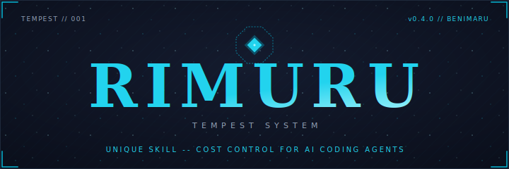

<p align="center">
  
</p>

<p align="center">
  <strong>Unified AI Agent Orchestration & Cost Tracking Platform</strong><br/>
  <em>Like Rimuru Tempest absorbs skills, Rimuru absorbs your AI agents into one place.</em>
</p>

<p align="center">
  <a href="https://github.com/rohitg00/rimuru/actions/workflows/ci.yml"></a>
  <a href="https://opensource.org/licenses/Apache-2.0"></a>
  <a href="https://www.rust-lang.org/"></a>
  <a href="https://github.com/rohitg00/rimuru/releases"></a>
</p>

<p align="center">
  <a href="#features">Features</a> &middot;
  <a href="#quick-start">Quick Start</a> &middot;
  <a href="#architecture">Architecture</a> &middot;
  <a href="#supported-agents">Agents</a> &middot;
  <a href="#web-ui">Web UI</a> &middot;
  <a href="#contributing">Contributing</a>
</p>

---

## Overview

Rimuru is a central hub for managing, monitoring, and analyzing costs across multiple AI coding agents. Built on [iii-engine](https://github.com/iii-hq/iii) (Worker/Function/Trigger primitives), it replaces PostgreSQL with in-memory KV state, collapses TUI + Desktop into a single web UI, and cuts the codebase by ~74%.

**Why Rimuru?**
- **One Dashboard** &mdash; See all your AI agents in one place via web UI
- **Cost Control** &mdash; Track spending across agents, sessions, and models
- **Real-time Monitoring** &mdash; Watch sessions, metrics, and usage as they happen
- **Extensible** &mdash; Add plugins (Rust or TypeScript), hooks, and integrations
- **Zero Dependencies** &mdash; No PostgreSQL, no Docker &mdash; just the iii engine and the rimuru worker

## Architecture

```
                    iii Engine (49134 WS / 3111 REST / 3112 Streams)
                             |
              +--------------+--------------+
              |              |              |
        rimuru-core    rimuru-ui       plugin Workers
        (Rust Worker)  (React SPA)     (Rust or TS)
```

- **rimuru-core**: Rust Worker &mdash; adapters, 21+ functions, 22 HTTP triggers, 5 schedule triggers, hooks, KV state
- **rimuru-cli**: Thin Rust CLI &mdash; connects as ephemeral Worker, calls functions, prints output
- **rimuru-ui**: React 19 + Vite single-file HTML &mdash; served via HTTP trigger, fetches `/api/*`
- **plugins**: Each plugin is a separate iii Worker process (Rust or TypeScript)

## Features

### Multi-Agent Support

Manage 6 AI coding agents from a single interface:

| Agent | Icon | Discovery Path |
|-------|------|----------------|
| **Claude Code** | ⟁ | `~/.claude/` |
| **Cursor** | ◫ | `~/Library/Application Support/Cursor/` |
| **GitHub Copilot** | ◈ | VS Code extension storage |
| **Codex** | ◎ | `~/.config/codex/` |
| **Goose** | ⬡ | `~/.config/goose/` |
| **OpenCode** | ◇ | `~/.opencode/` |

### Cost Tracking
- Real-time cost monitoring with detailed breakdowns by agent, session, and model
- Automatic model pricing sync from 5 providers (Anthropic, OpenAI, Google, OpenRouter, LiteLLM)
- Daily cost rollups and per-agent summaries
- Budget tracking with threshold alerts via hooks

### Web UI

Single-file React app (~1MB) served directly by the worker:

| Page | Description |
|------|-------------|
| **Dashboard** | Stats cards, activity feed, mini charts |
| **Agents** | Agent cards with status, connect/disconnect |
| **Sessions** | Table + timeline views with filtering |
| **Costs** | Pie, bar, and line charts (Recharts) |
| **Models** | Model pricing table with provider grouping |
| **Metrics** | Real-time gauges and history charts |
| **Plugins** | Installed plugins with enable/disable |
| **Hooks** | Hook configurations and execution log |
| **MCP Servers** | Discovered MCP servers from Claude configs |
| **Settings** | Configuration key/value editor |

Ships with 15 themes (Rimuru Slime, Tokyo Night, Catppuccin, Dracula, Nord, etc.) and a Cmd+K command palette.

### Plugin System

Each plugin runs as a separate iii Worker:
- **Rust plugins**: Standalone binary using `iii-sdk` crate
- **TypeScript plugins**: Node.js process using `iii-sdk` npm package
- Plugins register namespaced functions and hooks via the engine

### Hook System

11 event types: `AgentConnected`, `AgentDisconnected`, `SessionStarted`, `SessionEnded`, `CostRecorded`, `ModelSynced`, `MetricsCollected`, `PluginInstalled`, `PluginUninstalled`, `ThresholdExceeded`, `HealthCheckFailed`

## Quick Start

### Prerequisites

- **Rust** nightly (or edition 2024 support)
- **iii engine** v0.3.0+ running locally
- **Node.js** 18+ (for building the web UI)

### Build & Run

```bash
git clone https://github.com/rohitg00/rimuru.git
cd rimuru
git checkout rimuru-iii

cd ui && npm install && npm run build && cd ..

cargo build --release

RIMURU_API_PORT=3100 ./target/release/rimuru-worker
```

Open `http://localhost:3100` in your browser.

### CLI

```bash
./target/release/rimuru agents list
./target/release/rimuru agents detect
./target/release/rimuru sessions list
./target/release/rimuru costs summary
./target/release/rimuru costs daily
./target/release/rimuru models list
./target/release/rimuru metrics current
./target/release/rimuru plugins list
./target/release/rimuru hooks list
./target/release/rimuru mcp list
./target/release/rimuru health
./target/release/rimuru config get
```

All commands support `--format table|json|yaml`.

## API Endpoints

| Method | Path | Description |
|--------|------|-------------|
| GET | `/api/agents` | List all agents |
| GET | `/api/agents/:id` | Get agent details |
| POST | `/api/agents` | Register agent |
| POST | `/api/agents/:id/connect` | Connect to agent |
| GET | `/api/agents/detect` | Auto-detect installed agents |
| GET | `/api/sessions` | List sessions |
| GET | `/api/sessions/active` | Get active sessions |
| GET | `/api/costs/summary` | Cost summary |
| GET | `/api/costs/daily` | Daily cost breakdown |
| POST | `/api/costs` | Record cost |
| GET | `/api/models` | List models with pricing |
| POST | `/api/models/sync` | Sync model pricing |
| GET | `/api/metrics` | Current system metrics |
| GET | `/api/metrics/history` | Metrics history |
| GET | `/api/plugins` | List installed plugins |
| GET | `/api/hooks` | List registered hooks |
| GET | `/api/mcp` | List MCP servers |
| GET | `/api/health` | Health check |
| GET | `/api/stats` | Dashboard stats |

## Project Structure

```
rimuru/
├── Cargo.toml                    # Workspace
├── iii-config.yaml               # iii engine config
├── crates/
│   ├── rimuru-core/
│   │   └── src/
│   │       ├── lib.rs
│   │       ├── worker.rs         # iii Worker setup
│   │       ├── state.rs          # KV wrapper
│   │       ├── http.rs           # Axum HTTP server
│   │       ├── discovery.rs      # Shared filesystem discovery
│   │       ├── adapters/         # 6 agent adapters + detection
│   │       ├── functions/        # 21+ iii functions
│   │       ├── triggers/         # HTTP + schedule triggers
│   │       ├── hooks/            # Hook registry + dispatch
│   │       └── models/           # Data models
│   └── rimuru-cli/
│       └── src/
│           ├── main.rs           # Clap CLI entry
│           ├── output.rs         # Table/JSON/YAML formatting
│           └── commands/         # Subcommand handlers
├── ui/
│   └── src/
│       ├── App.tsx               # Router + Layout
│       ├── utils/format.ts       # Shared formatting utils
│       ├── pages/                # 10 page components
│       ├── components/           # Reusable UI components
│       ├── hooks/                # useQuery, useStream
│       └── api/                  # Client + types
└── plugins/
    ├── example-rust/             # Reference Rust plugin
    └── example-ts/               # Reference TS plugin
```

## Development

```bash
cargo build --release
cargo test --all

cd ui
npm install
npm run dev
npm run build
```

## Contributing

We welcome contributions! Please see our [Contributing Guidelines](CONTRIBUTING.md).

1. Fork the repository
2. Create a feature branch (`git checkout -b feature/amazing-feature`)
3. Commit your changes
4. Push and open a Pull Request

## License

Licensed under the Apache License, Version 2.0. See [LICENSE](LICENSE) for details.

## Acknowledgments

- [iii-engine](https://github.com/iii-hq/iii) for the Worker/Function/Trigger runtime
- [SkillKit](https://agenstskills.com) for skill marketplace integration
- **Rimuru Tempest** for the color inspiration

---

<p align="center">
  Made with ♥ by <a href="https://github.com/rohitg00">Rohit Ghumare</a>
</p>
