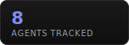
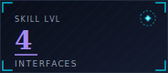
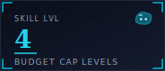
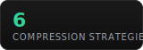
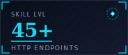
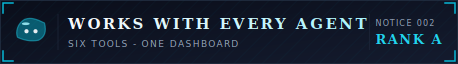
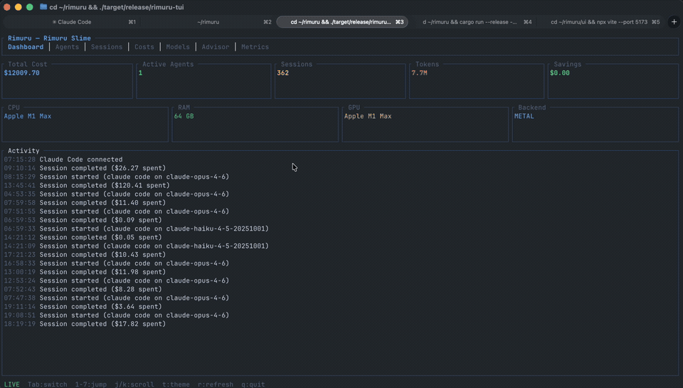
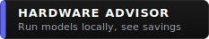
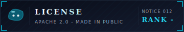

<p align="center">
  
</p>

<p align="center">
  <strong>Cost control for AI coding agents.</strong><br/>
  Budget guardrails, runaway loop detection, process wrappers, and output compression.<br/>
  Built on the iii-engine. Four interfaces. Zero external dependencies.
</p>

<p align="center">
  <a href="https://github.com/rohitg00/rimuru/releases"></a>
  <a href="https://github.com/rohitg00/rimuru/actions/workflows/ci.yml"></a>
  <a href="https://opensource.org/licenses/Apache-2.0"></a>
  <a href="https://www.rust-lang.org"></a>
  <a href="https://github.com/rohitg00/rimuru/stargazers"></a>
</p>

<p align="center">
  <picture><source media="(prefers-color-scheme: dark)" srcset="docs/assets/tags/light/stat-agents.svg"></picture>
  <picture><source media="(prefers-color-scheme: dark)" srcset="docs/assets/tags/light/stat-functions.svg"></picture>
  <picture><source media="(prefers-color-scheme: dark)" srcset="docs/assets/tags/light/stat-interfaces.svg"></picture>
</p>

<p align="center">
  <picture><source media="(prefers-color-scheme: dark)" srcset="docs/assets/tags/light/stat-caps.svg"></picture>
  <picture><source media="(prefers-color-scheme: dark)" srcset="docs/assets/tags/light/stat-strategies.svg"></picture>
  <picture><source media="(prefers-color-scheme: dark)" srcset="docs/assets/tags/light/stat-endpoints.svg"></picture>
</p>

<p align="center">
  <picture><source media="(prefers-color-scheme: dark)" srcset="docs/assets/tags/light/pill-v040.svg"></picture>
  <picture><source media="(prefers-color-scheme: dark)" srcset="docs/assets/tags/light/pill-rust.svg"></picture>
  <picture><source media="(prefers-color-scheme: dark)" srcset="docs/assets/tags/light/pill-iii.svg"></picture>
  <picture><source media="(prefers-color-scheme: dark)" srcset="docs/assets/tags/light/pill-tauri.svg"></picture>
  <picture><source media="(prefers-color-scheme: dark)" srcset="docs/assets/tags/light/pill-apache2.svg"></picture>
</p>

<p align="center">
  
</p>

<p align="center">
  <a href="#why-rimuru">Why</a> &middot;
  <a href="#quick-start">Quick Start</a> &middot;
  <a href="#budget-engine">Budget</a> &middot;
  <a href="#runaway-detection">Runaway</a> &middot;
  <a href="#guard-wrapper">Guard</a> &middot;
  <a href="#output-compression">Compression</a> &middot;
  <a href="#interfaces">Interfaces</a> &middot;
  <a href="#architecture">Architecture</a>
</p>

<p align="center">
  
</p>

<br/>

<h2 id="why-rimuru"><picture><source media="(prefers-color-scheme: dark)" srcset="docs/assets/tags/light/section-why.svg"></picture></h2>

> *Notice. Subject is running four concurrent agents. Projected monthly spend exceeds threshold by 182%. Recommending immediate containment.*

One developer. Six agents running in parallel. Claude Code in one terminal, Cursor open in the IDE, Codex piped into a script, Copilot silently billing by the token. The invoice lands at the end of the month and it is already too late.

Rimuru is the control plane between you and that bill. It discovers every agent on your machine, tracks spend in real time, enforces hard caps before the write hits state, detects runaway loops before they finish burning, wraps processes with a kill switch, and compresses tool output so context windows stop bleeding tokens. One engine. Four interfaces. Zero external dependencies -- no Postgres, no Redis, no Docker.

Everything ships as [iii-engine](https://github.com/iii-hq/iii) primitives (Worker / Function / Trigger). State lives in the engine's in-memory KV under scoped namespaces. The CLI talks to the engine via `trigger()`. The Web UI, TUI, and Desktop app all share the same function surface.

<br/>

<h2 id="quick-start"><picture><source media="(prefers-color-scheme: dark)" srcset="docs/assets/tags/light/section-quickstart.svg"></picture></h2>

> *System initiated. Acquiring agents. Preparing dashboard.*

```bash
curl -fsSL https://raw.githubusercontent.com/rohitg00/rimuru/main/install.sh | bash
```

Installs the iii engine if missing. Drops `rimuru-worker`, `rimuru`, `rimuru-tui` into `~/.local/bin`, copies the iii config to `~/.config/rimuru/config.yaml`, and creates the durable state directory at `~/.local/share/rimuru/`. Takes about thirty seconds on a warm cache.

```bash
iii --config ~/.config/rimuru/config.yaml  # start iii with durable state
rimuru-worker                              # start the worker
open http://localhost:3100
```

Rimuru stores cost records, budget counters, guard history, and session data under `~/.local/share/rimuru/` via iii-engine's file-backed KV. The shipped config flushes dirty state every 250 ms (`save_interval_ms: 250`), so restart-survival is bounded at roughly a quarter second of the most recent writes — iii-engine doesn't currently flush on shutdown, so anything written in the last flush window can be lost if the process is killed. For everyday use that's negligible; if you're running experiments where every last cost row matters, stop iii cleanly and give it a second before restart. Running bare `iii` (without `--config`) or `iii --use-default-config` falls back to the in-memory store, which iii itself warns against — everything you record disappears on shutdown.

Override the data directory with `RIMURU_DATA_DIR` when running the installer (e.g. `RIMURU_DATA_DIR=/var/lib/rimuru ./install.sh`); the installer rewrites the config in place so iii honors the override.

Detect your agents. See what you are spending. Set a cap.

```bash
rimuru agents detect
rimuru costs summary
rimuru config set budget_monthly 50
rimuru config set budget_action block
rimuru budget status
```

Other platforms: [pre-built binaries](https://github.com/rohitg00/rimuru/releases), [Docker image](https://github.com/rohitg00/rimuru/pkgs/container/rimuru), or [build from source](#development).

<br/>

<h2 id="agents"><picture><source media="(prefers-color-scheme: dark)" srcset="docs/assets/tags/light/section-agents.svg"></picture></h2>

> *Scanning filesystem. Six tools detected. Session histories indexed.*

Rimuru auto-discovers agents from their local config directories. No token swap, no auth dance, no proxy -- it reads session history the way each tool writes it.

<table>
<tr>
<td align="center" width="16.6%">
<a href="https://claude.com/product/claude-code"></a><br/>
<strong>Claude Code</strong><br/>
<sub><code>~/.claude/</code></sub>
</td>
<td align="center" width="16.6%">
<a href="https://cursor.com"></a><br/>
<strong>Cursor</strong><br/>
<sub><code>~/Library/Application Support/Cursor/</code></sub>
</td>
<td align="center" width="16.6%">
<a href="https://github.com/features/copilot"></a><br/>
<strong>GitHub Copilot</strong><br/>
<sub>VS Code extension</sub>
</td>
<td align="center" width="16.6%">
<a href="https://github.com/openai/codex"></a><br/>
<strong>Codex</strong><br/>
<sub><code>~/.config/codex/</code></sub>
</td>
<td align="center" width="16.6%">
<a href="https://github.com/block/goose"></a><br/>
<strong>Goose</strong><br/>
<sub><code>~/.config/goose/</code></sub>
</td>
<td align="center" width="16.6%">
<a href="https://github.com/opencode-ai/opencode"></a><br/>
<strong>OpenCode</strong><br/>
<sub><code>~/.opencode/</code></sub>
</td>
</tr>
</table>

Model pricing is maintained for 8 models across 5 providers. Six agent adapters ship in-tree. Cost records are idempotent -- re-syncing the same session overwrites rather than duplicates.

<br/>

<h2 id="budget-engine"><picture><source media="(prefers-color-scheme: dark)" srcset="docs/assets/tags/light/section-budget.svg"></picture></h2>

> *Unique Skill acquired. `Budget Engine` binds cost records to configured thresholds. Monthly, daily, session, and per-agent-daily caps will be enforced before write.*

Four cap levels. One enforcement path. Every cost record runs through `rimuru.budget.check` **before** it touches state. When caps are exceeded and `budget_action = block`, the recording is rejected and the error propagates back.

```bash
rimuru config set budget_monthly 50
rimuru config set budget_daily 5
rimuru config set budget_session 2
rimuru config set budget_daily_agent 10
rimuru config set budget_action block
```

| Field                    | Default  | What it caps                                             |
|--------------------------|----------|----------------------------------------------------------|
| `budget_monthly`         | `0.0`    | Total spend for the current calendar month               |
| `budget_daily`           | `0.0`    | Total spend for today                                    |
| `budget_session`         | `0.0`    | Spend attributed to a single `session_id`                |
| `budget_daily_agent`     | `0.0`    | Per-agent spend for today                                |
| `budget_alert_threshold` | `0.8`    | Warning fires at this fraction of any cap                |
| `budget_action`          | `alert`  | `alert` (log + hook), `warn` (log only), or `block` (reject the record) |

Status projects end-of-month spend from the current daily rate against the actual days in this month.

```bash
rimuru budget status
#  monthly_limit: $50.00    monthly_spent: $18.42    monthly_remaining: $31.58
#  daily_limit:   $5.00     daily_spent:   $1.37     daily_remaining:   $3.63
#  burn_rate:     $1.84/day projected_monthly: $55.20    // over cap
```

Threshold crossings fire the `budget.warning` hook. Cap breaches fire `budget.exceeded`. Alerts are persisted with millisecond + UUID keys so burst alerts never collide.

**Fail-open on service outage.** If the budget check itself is unreachable, cost recording logs a warning and proceeds. Only a successful *"exceeded + block"* response halts the write.

<br/>

<h2 id="runaway-detection"><picture><source media="(prefers-color-scheme: dark)" srcset="docs/assets/tags/light/section-runaway.svg"></picture></h2>

> *Analytical Skill engaged. Scanning last ten turns. Pattern recognition active. Severity score: 0.82. Recommending intervention.*

Four detection patterns run over the last N turns of a session. Severity scoring tells you how stuck it is. Token accounting tells you how much was wasted.

| Pattern            | Trigger                                                          | Severity        |
|--------------------|------------------------------------------------------------------|-----------------|
| `repeated_calls`   | Same tool name repeated > `runaway_repeat_threshold` times       | `min(1, n/10)`  |
| `repeated_errors`  | Identical `content_type + role` signature > threshold times      | `min(1, n/8)`   |
| `token_explosion`  | Last 3 turns > ratio × baseline input tokens (baseline excludes last 3) | `min(1, (ratio-1)/4)` |
| `oscillation`      | Two tools alternating > 4 times                                  | `min(1, n/8)`   |

```bash
rimuru.runaway.analyze  '{"session_id": "...", "window": 15}'
rimuru.runaway.scan     '{}'
rimuru.runaway.configure '{"repeat_threshold": 4, "token_explosion_ratio": 2.5}'
```

The token-explosion baseline *excludes* the last 3 turns so spike samples can never inflate the average they are compared against. Invalid thresholds (zero window, ratio ≤ 1.0, non-boolean `auto_scan_enabled`) are rejected at write time.

<br/>

<h2 id="guard-wrapper"><picture><source media="(prefers-color-scheme: dark)" srcset="docs/assets/tags/light/section-guard.svg"></picture></h2>

> *Bind Skill activated. Target process wrapped. Polling cost every five seconds. On threshold breach, issuing kill signal.*

Wrap any agent process in a cost limit. The wrapper polls cost totals every five seconds from the guard start time and either warns or kills the child when the limit is crossed.

```bash
rimuru guard start --limit 5.00 --action kill -- claude
rimuru guard start --limit 2.00 --action warn -- cursor --cli
rimuru guard status
rimuru guard history
```

- **Spawn first, register second.** If `Command::spawn()` fails, nothing gets written to KV. The register payload includes the real PID.
- **Scoped cost query.** `rimuru.costs.summary` is called with `since = started_at` -- global totals from yesterday never trip today's guard.
- **Stderr diagnostics.** The wrapper banner, warnings, and summary go to `stderr` so they do not corrupt the wrapped process's `stdout`.
- **Atomic completion.** History is written *before* the active guard is deleted. A half-failed write leaves the ledger consistent.
- **Typed flags.** `--action` is a `clap::ValueEnum` (`kill` or `warn`). `--limit` rejects NaN, infinity, and non-positive values at parse time.

<br/>

<h2 id="output-compression"><picture><source media="(prefers-color-scheme: dark)" srcset="docs/assets/tags/light/section-compression.svg"></picture></h2>

> *Transmutation Skill engaged. Tool response exceeds threshold. Selecting compression strategy. Auto mode: `JsonPaths`. Estimated token savings: 73%.*

The MCP proxy compresses tool responses over 2000 tokens before they reach the agent. `Auto` inspects the payload shape and routes to the strategy that fits.

| Strategy     | Picked when                                           | What it does                                                             |
|--------------|-------------------------------------------------------|---------------------------------------------------------------------------|
| `Auto`       | default -- inspects content                           | Routes to one of the strategies below                                     |
| `JsonPaths`  | object or array with > 50 keys or > 5K tokens         | Shallow keys kept; deep nodes → `{__depth, __keys}`; long arrays → head + tail + truncation marker |
| `ErrorsOnly` | string with error / warning / fail / panic lines      | Keeps matched lines plus 3 lines of prior context                         |
| `TreeView`   | string that looks like a file listing                 | Paths rendered as an indented tree                                        |
| `Summarize`  | plain text                                            | First 10 + last 5 lines, removes the middle                               |
| `Truncate`   | fallback                                              | Char-safe truncation at `~max_tokens × 3` chars                           |

All string truncation uses `char_indices().nth()` -- multi-byte characters cannot split mid-codepoint. Max-char arithmetic uses `saturating_mul` so extreme `max_tokens` never wraps. If a smart strategy does not drop below the cap, the fallback is `Truncate`.

```bash
rimuru mcp stats
# github::issues_list    calls=42   saved=18,924 tokens   compressed=12
# filesystem::read_file  calls=117  saved=61,302 tokens   compressed=48
```

<br/>

<h2 id="interfaces"><picture><source media="(prefers-color-scheme: dark)" srcset="docs/assets/tags/light/section-interfaces.svg"></picture></h2>

> *Four manifestation forms registered. Select the one that matches your current task.*

Every function is reachable from four front-ends. Pick the one that fits.

| Form | Binary | What it is |
|------|--------|-----------|
| **Web UI** | embedded in `rimuru-worker` on `:3100` | 13 pages -- Dashboard, Agents, Sessions, Costs, Models, Advisor, Context, MCP Proxy, City, Plugins, Hooks, Settings, Terminal. Single-file React build, ~1 MB, served directly by the worker. |
| **CLI** | `rimuru` | 13 command groups, `--format table\|json\|yaml`, direct iii trigger calls (no HTTP middleman). |
| **TUI** | `rimuru-tui` | Ratatui 0.29. 12 tabs, 15 Tensura-themed color schemes (Rimuru Slime, Great Sage, Predator, Veldora, Shion, Milim, Diablo, and more). Keyboard nav: `Tab`, `j`/`k`, `1-9`, `/`, `t`, `?`. |
| **Desktop** | `rimuru-desktop` | Tauri v2 native app with embedded worker. 46 IPC commands across 10 modules, system tray, global shortcut, window state persistence. |

<p align="center">
  
</p>

<br/>

<h2 id="hardware-advisor"><picture><source media="(prefers-color-scheme: dark)" srcset="docs/assets/tags/light/section-advisor.svg"></picture></h2>

> *Detecting hardware. CPU + RAM + GPU acquired. Mapping API models to local equivalents. Projected monthly savings computed.*

The advisor detects CPU, RAM, and GPU (Metal / CUDA / ROCm) and maps every API model you use to a local equivalent from a 50+ model catalog. Fit is scored `Perfect`, `Good`, `Marginal`, or `Too Tight`, with tok/s estimates and projected monthly savings.

```bash
rimuru models advisor
#  Claude Sonnet 4    ->  Qwen2.5-14B (Q4_K_M)    fit: Perfect     savings: $34/mo
#  Claude Opus 4.5    ->  Llama 3.3 70B (Q4_0)    fit: Marginal    savings: $128/mo
#  GPT-4o             ->  Qwen2.5-32B (Q5_K_M)    fit: Good        savings: $41/mo
```

<br/>

<h2 id="architecture"><picture><source media="(prefers-color-scheme: dark)" srcset="docs/assets/tags/light/section-architecture.svg"></picture></h2>

```text
                       iii Engine  (WS :49134)
                              │
         ┌────────────────────┼────────────────────┐
         │                    │                    │
   rimuru-worker         rimuru-cli          rimuru-desktop
   (core + iii-http)     (iii trigger)       (Tauri v2 + embedded worker)
         │
   ┌─────┴─────┐
   │           │
  Web UI    rimuru-tui
  (:3100)   (HTTP client)
```

| Crate            | Binary            | What it is |
|------------------|-------------------|------------|
| `rimuru-core`    | `rimuru-worker`   | iii worker with 60+ registered functions, 45+ HTTP endpoints via `iii-http`, budget / runaway / guard / compression / advisor modules, agent adapters, hook dispatcher, embedded web UI |
| `rimuru-cli`     | `rimuru`          | Clap CLI. Connects via `register_worker`, invokes functions through `iii.trigger()`. No HTTP hop |
| `rimuru-tui`     | `rimuru-tui`      | Ratatui 0.29 terminal UI. HTTP client against the worker |
| `rimuru-desktop` | `rimuru-desktop`  | Tauri v2 app with the worker embedded. 46 IPC commands forwarding to the in-process engine |

State lives in the engine's in-memory KV under scoped namespaces: `agents`, `sessions`, `cost_records`, `cost_daily`, `cost_agent`, `budgets`, `budget_alerts`, `guards`, `guard_history`, `mcp_servers`, `mcp_metrics`, `hooks`, `plugins`, `config`, `context_breakdowns`.

<br/>

<h2 id="api"><picture><source media="(prefers-color-scheme: dark)" srcset="docs/assets/tags/light/section-api.svg"></picture></h2>

Two call paths. Overlapping but not identical surfaces.

- **HTTP** via `iii-http` on `:3111` -- registered from the central route table in [`crates/rimuru-core/src/triggers/api.rs`](crates/rimuru-core/src/triggers/api.rs). Payloads are normalized by `extract_input()` so path params, query params, and bodies merge into one `Value`.
- **Direct trigger** via the iii WebSocket -- `iii.trigger(TriggerRequest { function_id: "rimuru.budget.check", ... })`. This is what the CLI uses to skip the HTTP hop.

The HTTP layer now covers everything including the v0.4.0 guardrails: agents, sessions, costs, **budget**, **runaway**, **guard**, context, models, advisor, metrics, health, MCP proxy, hooks, plugins, and config. The CLI prefers direct triggers for latency; external clients (Web UI, curl, scripts) use the HTTP routes.

Function namespaces:

```text
rimuru.agents.*       list, get, create, connect, disconnect, detect   (plus update/delete/status/sync via trigger)
rimuru.sessions.*     list, get, active, history                       (plus cleanup via trigger)
rimuru.costs.*        summary, daily, by_agent, record                 (plus daily_rollup via trigger)
rimuru.budget.*       check, status, set, alerts
rimuru.runaway.*      analyze, scan, configure
rimuru.guard.*        list, register, complete, history
rimuru.hardware.*     get, detect
rimuru.models.*       list, get, sync
rimuru.advisor.*      assess, catalog
rimuru.metrics.*      current, history
rimuru.context.*      breakdown, breakdown_by_session, utilization, waste
rimuru.mcp.proxy.*    connect, tools, call, search, stats, disconnect
rimuru.hooks.*        register, dispatch
rimuru.plugins.*      install, uninstall, start, stop
rimuru.config.*       get, set
rimuru.health.*       check
```

Full HTTP endpoint list with methods and paths is in [`docs/api.md`](docs/api.md).

<br/>

<h2 id="development"><picture><source media="(prefers-color-scheme: dark)" srcset="docs/assets/tags/light/section-development.svg"></picture></h2>

```bash
git clone https://github.com/rohitg00/rimuru.git
cd rimuru

cd ui && npm ci && npm run build && cd ..    # single-file production UI
cargo build --release                         # all four crates

cargo fmt --check
cargo clippy --all-targets -- -D warnings
cargo test --workspace
```

Binaries land in `target/release/`: `rimuru-worker`, `rimuru`, `rimuru-tui`, `rimuru-desktop`.

The README SVG design system (Tempest UI) lives in `scripts/generate-readme-tags.py`. Regenerate tags from Python -- don't hand-edit the SVGs under `docs/assets/tags/`.

```bash
python3 scripts/generate-readme-tags.py
```

Pull requests welcome. Keep the no-emoji rule in commits, README, and section headers.

<br/>

<h2 id="license"><picture><source media="(prefers-color-scheme: dark)" srcset="docs/assets/tags/light/section-license.svg"></picture></h2>

Apache License 2.0. See [LICENSE](LICENSE).

Built on [iii-engine](https://github.com/iii-hq/iii) (Worker / Function / Trigger primitives). Terminal UI powered by [Ratatui](https://ratatui.rs). Desktop app powered by [Tauri](https://tauri.app). The name and "Unique Skill" framing are a nod to *That Time I Got Reincarnated as a Slime* by Fuse.

<p align="center">
  
</p>

<p align="center">
  <sub><i>Tempest System // v0.4.0 Benimaru // made by <a href="https://github.com/rohitg00">Rohit Ghumare</a></i></sub>
</p>
