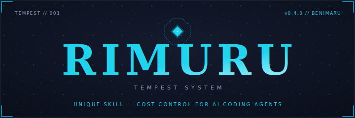

<p align="center">
  
</p>

<p align="center">
  <strong>AI Agent Cost Monitor powered by iii-engine</strong><br/>
  <em>Like Rimuru Tempest absorbs skills, Rimuru absorbs your AI agents into one place.</em>
</p>

<p align="center">
  <a href="https://github.com/rohitg00/rimuru/actions/workflows/ci.yml"></a>
  <a href="https://opensource.org/licenses/MIT"></a>
  <a href="https://www.rust-lang.org/"></a>
  <a href="https://github.com/rohitg00/rimuru/releases"></a>
</p>

<p align="center">
  <a href="#features">Features</a> &middot;
  <a href="#quick-start">Quick Start</a> &middot;
  <a href="#architecture">Architecture</a> &middot;
  <a href="#four-interfaces">Interfaces</a> &middot;
  <a href="#hardware-advisor">Advisor</a> &middot;
  <a href="#contributing">Contributing</a>
</p>

---

## Overview

Rimuru monitors and optimizes costs across multiple AI coding agents. Built on [iii-engine](https://github.com/iii-hq/iii) (Worker/Function/Trigger primitives), it uses in-memory KV state instead of PostgreSQL and ships four interfaces: Web UI, CLI, TUI, and Desktop app.

**Why Rimuru?**
- **One Dashboard** &mdash; See all AI agents, sessions, and costs in one place
- **Cost Optimizer** &mdash; Hardware advisor tells you which models can run locally to save money
- **Four Interfaces** &mdash; Web UI, CLI, TUI (15 Tensura themes), and native Desktop app
- **Real-time** &mdash; Live metrics, session tracking, and agent status via SSE streams
- **Zero Dependencies** &mdash; No PostgreSQL, no Docker required &mdash; just the iii engine

## Architecture

```
                iii Engine (WS :49134)
                        |
         +--------------+--------------+
         |              |              |
   rimuru-worker   rimuru-cli    rimuru-desktop
   (core + HTTP)   (iii client)  (Tauri v2 + embedded worker)
         |
   +-----------+
   |           |
  Web UI    rimuru-tui
  (:3100)   (HTTP client)
```

**4 Crates:**

| Crate | Binary | Description |
|-------|--------|-------------|
| `rimuru-core` | `rimuru-worker` | iii Worker with 40+ API endpoints, axum HTTP server, embedded Web UI |
| `rimuru-cli` | `rimuru` | CLI that connects to iii engine, calls functions, prints output |
| `rimuru-tui` | `rimuru-tui` | Ratatui terminal UI with 10 tabs and 15 themes |
| `rimuru-desktop` | Desktop app | Tauri v2 native app with embedded worker (46 IPC commands) |

## Features

### Supported Agents

| Agent | Discovery | Provider |
|-------|-----------|----------|
| **Claude Code** | `~/.claude/` | Anthropic |
| **Cursor** | `~/Library/Application Support/Cursor/` | OpenAI |
| **GitHub Copilot** | VS Code extension storage | OpenAI |
| **Codex** | `~/.config/codex/` | OpenAI |
| **Goose** | `~/.config/goose/` | Various |
| **OpenCode** | `~/.opencode/` | Various |

### Cost Tracking
- Real-time cost monitoring with breakdowns by agent, session, and model
- Idempotent cost records (re-syncing the same session overwrites, not duplicates)
- Automatic model pricing for 8 models across 5 providers
- Daily cost rollups and per-agent summaries

### Hardware Advisor

Tells you which API models can run locally on your hardware:

- Detects CPU, RAM, GPU (Metal/CUDA/ROCm) automatically
- Maps each API model to a local equivalent (e.g., Claude Sonnet &rarr; Qwen2.5-14B)
- Scores fit level: **Perfect**, **Good**, **Marginal**, or **Too Tight**
- Estimates tok/s and potential cost savings
- Includes a 50+ model catalog with quantization recommendations

### Web UI

Single-file React app (~1MB) served directly by the worker at `http://localhost:3100`:

| Page | Description |
|------|-------------|
| **Dashboard** | Stats overview, potential savings, activity feed |
| **Agents** | Agent cards with status, connect/disconnect |
| **Sessions** | Filterable table with timeline views |
| **Costs** | Pie, bar, and line charts (Recharts) |
| **Models** | Model pricing with local fit columns |
| **Advisor** | Hardware-aware model catalog with fit scoring |
| **Metrics** | Real-time CPU/memory gauges and sparklines |
| **City** | Pixel art isometric view of agents as characters |
| **Plugins** | Installed plugins with enable/disable |
| **Hooks** | Hook configurations and execution log |
| **MCP Servers** | Discovered MCP servers from Claude configs |
| **Settings** | Configuration editor |
| **Terminal** | Embedded terminal |

Ships with 15 themes and a Cmd+K command palette.

### TUI

Rich terminal UI built with Ratatui 0.29:

- 10 tabs: Dashboard, Agents, Sessions, Costs, Models, Metrics, Plugins, Hooks, MCP, Help
- 15 Tensura-themed color schemes (Rimuru Slime, Great Sage, Predator, Veldora, Shion, Milim, Diablo + editor themes)
- Keyboard navigation: `Tab`/`BackTab`, `j`/`k`, `1-9` tab jump, `/` search, `t` theme cycle, `?` help

### Desktop App

Tauri v2 native app with fully embedded worker:

- Self-contained &mdash; no separate server process needed
- 46 IPC commands across 10 modules (agents, sessions, costs, models, metrics, plugins, hooks, settings, sync, export)
- System tray with quick actions
- Global shortcut: `CmdOrCtrl+Shift+R`
- Window state persistence (position/size saved across sessions)

### Plugin & Hook System

- Plugins run as separate iii Worker processes (Rust or TypeScript)
- 11 hook events: `AgentConnected`, `AgentDisconnected`, `SessionStarted`, `SessionEnded`, `CostRecorded`, `ModelSynced`, `MetricsCollected`, `PluginInstalled`, `PluginUninstalled`, `ThresholdExceeded`, `HealthCheckFailed`

## Installation

### One-line install (Linux / macOS)

```bash
curl -fsSL https://raw.githubusercontent.com/rohitg00/rimuru/main/install.sh | bash
```

This installs the **iii engine** (if not already present) and all rimuru binaries (`rimuru-worker`, `rimuru`, `rimuru-tui`) to `~/.local/bin`.

Set a custom install directory:

```bash
RIMURU_INSTALL_DIR=/usr/local/bin curl -fsSL https://raw.githubusercontent.com/rohitg00/rimuru/main/install.sh | bash
```

Install a specific version:

```bash
curl -fsSL https://raw.githubusercontent.com/rohitg00/rimuru/main/install.sh | bash -s v0.1.0
```

### Pre-built binaries

Download from [GitHub Releases](https://github.com/rohitg00/rimuru/releases):

| Platform | Package | Contents |
|----------|---------|----------|
| Linux x64 | `rimuru-vX.Y.Z-linux-x64.tar.gz` | rimuru-worker, rimuru, rimuru-tui |
| macOS x64 | `rimuru-vX.Y.Z-macos-x64.tar.gz` | rimuru-worker, rimuru, rimuru-tui |
| Windows x64 | `rimuru-vX.Y.Z-windows-x64.zip` | rimuru-worker.exe, rimuru.exe, rimuru-tui.exe |

### Desktop app

| Platform | Download |
|----------|----------|
| macOS | `rimuru-desktop.dmg` |
| Linux | `rimuru-desktop.AppImage` |

### From source

```bash
git clone https://github.com/rohitg00/rimuru.git
cd rimuru

cd ui && npm ci && npm run build && cd ..

cargo build --release
```

Binaries are in `target/release/`: `rimuru-worker`, `rimuru`, `rimuru-tui`.

### Docker

```bash
docker build -t rimuru .
docker run -p 3100:3100 rimuru
```

## Quick Start

### Run

```bash
iii                    # start the iii engine (installed automatically)
rimuru-worker          # start the worker
```

Open `http://localhost:3100` in your browser.

### CLI

```bash
rimuru agents list
rimuru agents detect
rimuru sessions list
rimuru costs summary
rimuru costs daily
rimuru models list
rimuru metrics current
rimuru plugins list
rimuru hooks list
rimuru mcp list
rimuru health
rimuru config get
rimuru ui              # opens web UI in browser
```

All commands support `--format table|json`.

### TUI

```bash
rimuru-tui --port 3100 --theme 0
```

## API Endpoints

| Method | Path | Description |
|--------|------|-------------|
| GET | `/api/agents` | List all agents |
| GET | `/api/agents/:id` | Get agent details |
| POST | `/api/agents` | Create agent |
| POST | `/api/agents/connect` | Connect agent |
| POST | `/api/agents/:id/disconnect` | Disconnect agent |
| GET | `/api/agents/detect` | Auto-detect installed agents |
| GET | `/api/sessions` | List sessions |
| GET | `/api/sessions/:id` | Get session details |
| GET | `/api/sessions/active` | Active sessions |
| GET | `/api/sessions/history` | Session history |
| GET | `/api/costs/summary` | Cost summary |
| GET | `/api/costs/daily` | Daily cost breakdown |
| GET | `/api/costs/agent/:id` | Cost by agent |
| POST | `/api/costs` | Record cost |
| GET | `/api/system` | Hardware info |
| POST | `/api/system/detect` | Detect hardware |
| GET | `/api/models` | List models with pricing |
| GET | `/api/models/:id` | Get model details |
| GET | `/api/models/advisor` | Local model advisories |
| GET | `/api/models/catalog` | Full model catalog with fit scoring |
| POST | `/api/models/sync` | Sync model pricing |
| GET | `/api/metrics` | Current system metrics |
| GET | `/api/metrics/history` | Metrics history |
| GET | `/api/plugins` | List plugins |
| POST | `/api/plugins/install` | Install plugin |
| DELETE | `/api/plugins/:id` | Uninstall plugin |
| POST | `/api/hooks/register` | Register hook |
| POST | `/api/hooks/dispatch` | Dispatch hook event |
| GET | `/api/config` | Get configuration |
| PUT | `/api/config` | Update configuration |
| GET | `/api/health` | Health check |

## Project Structure

```
rimuru/
├── Cargo.toml                    # Workspace (4 crates)
├── Dockerfile                    # Multi-stage build
├── iii-config.yaml               # iii engine config
├── crates/
│   ├── rimuru-core/              # Worker + HTTP server
│   │   └── src/
│   │       ├── main.rs           # Worker entry point
│   │       ├── worker.rs         # iii Worker setup + startup triggers
│   │       ├── state.rs          # Scoped KV wrapper
│   │       ├── http.rs           # Axum HTTP server (40+ endpoints)
│   │       ├── discovery.rs      # Filesystem agent/plugin/MCP discovery
│   │       ├── adapters/         # 6 agent adapters
│   │       ├── functions/        # iii functions (agents, costs, sessions,
│   │       │                     #   models, metrics, hardware, hooks, etc.)
│   │       ├── triggers/         # HTTP route table
│   │       └── models/           # Data structs (agent, session, cost,
│   │                             #   hardware, model_info, plugin, metrics)
│   ├── rimuru-cli/               # CLI
│   │   └── src/
│   │       ├── main.rs           # Clap CLI (9 subcommands)
│   │       ├── output.rs         # Table/JSON formatting
│   │       └── commands/         # Subcommand handlers
│   ├── rimuru-tui/               # Terminal UI
│   │   └── src/
│   │       ├── main.rs           # Async event loop
│   │       ├── app.rs            # App state + tab management
│   │       ├── client.rs         # HTTP API client
│   │       ├── theme.rs          # 15 Tensura themes
│   │       ├── ui.rs             # Layout + status bar
│   │       └── views/            # 10 tab views
│   └── rimuru-desktop/           # Tauri v2 Desktop app
│       └── src/
│           ├── main.rs           # Entry point
│           ├── lib.rs            # Tauri setup (embedded worker)
│           ├── state.rs          # AppState (III + KV)
│           ├── commands/         # 46 IPC commands (10 modules)
│           ├── tray.rs           # System tray
│           ├── events.rs         # Event emission
│           └── window_state.rs   # Position/size persistence
├── ui/                           # React 19 + Vite + Tailwind
│   └── src/
│       ├── App.tsx               # Hash router + sidebar
│       ├── pages/                # 13 page components
│       ├── components/           # Reusable UI (StatusBadge, etc.)
│       ├── city/                 # Isometric pixel art engine
│       ├── hooks/                # useQuery, useStream
│       └── api/                  # Client + TypeScript types
└── docs/
    └── assets/                   # Banner SVG
```

## Development

```bash
cargo build --release
cargo test --all
cargo clippy --all-targets -- -D warnings

cd ui && npm ci && npm run dev     # dev server on :5173
cd ui && npm run build             # single-file production build
```

## Contributing

1. Fork the repository
2. Create a feature branch (`git checkout -b feature/amazing-feature`)
3. Commit your changes
4. Push and open a Pull Request

## License

Licensed under the MIT License. See [LICENSE](LICENSE) for details.

## Acknowledgments

- [iii-engine](https://github.com/iii-hq/iii) for the Worker/Function/Trigger runtime
- [Ratatui](https://ratatui.rs) for the TUI framework
- [Tauri](https://tauri.app) for the desktop app framework
- **Rimuru Tempest** for the theme inspiration

---

<p align="center">
  Made with ♥ by <a href="https://github.com/rohitg00">Rohit Ghumare</a>
</p>
